

  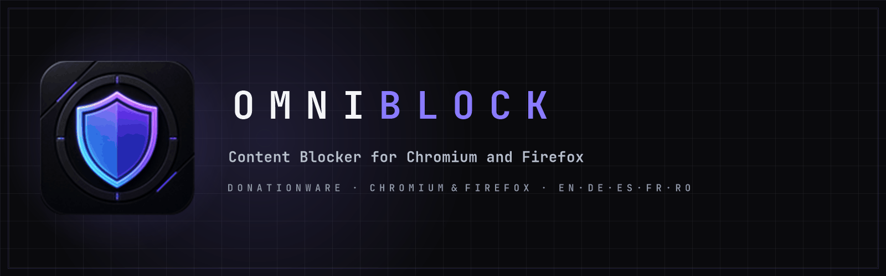

<h1 align="center">OmniBlock</h1>

<b>A content blocker for Chromium and Firefox — six protection levels, an always-on security shield, custom lists and per-site control.</b>

Part of the <a href="#the-omnivex-suite">OmniVex</a> suite.

  
  &nbsp;
  

  
  
  
  
  

<!-- Quick navigation. These are clickable: each chip jumps to a section of this
     page, or to the document it names. Anchors are GitHub's own slugs for the
     headings below -- if a heading is renamed, its chip has to be renamed too. -->

  
  
  
  
  
  
  
  
  

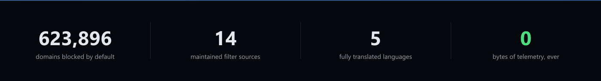

  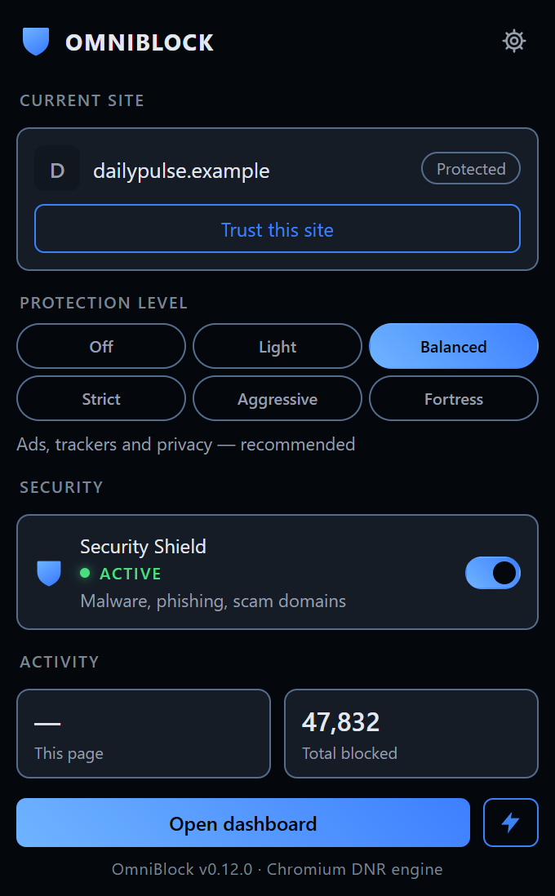

---

## What it does

OmniBlock blocks **623,896 distinct domains** at its default setting and
**694,738** at its highest level — ads, trackers, malware, phishing, scam and
fake-shop domains, compiled from fourteen maintained filter sources.

It is built around one idea: blocking should be something you *tune*, not
something you fight. One dial, six levels, and a security shield that stays on
even when you turn everything else off.

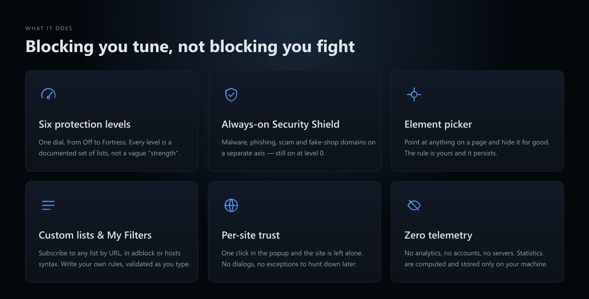

### Six protection levels

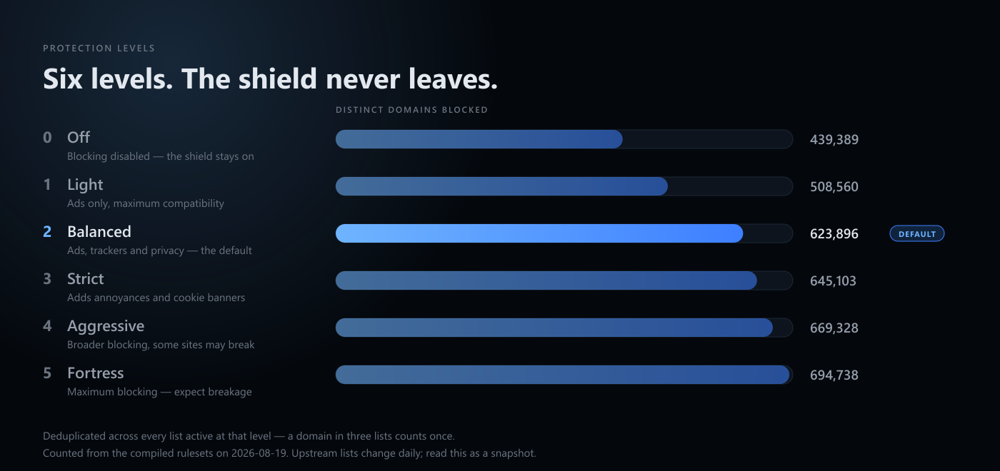

| Level | | What it blocks | Distinct domains |
|---|---|---|---:|
| 0 | **Off** | Blocking disabled — the shield stays on | 439,389 |
| 1 | **Light** | Ads only, maximum compatibility | 508,560 |
| 2 | **Balanced** | Ads, trackers and privacy — the default | 623,896 |
| 3 | **Strict** | Adds annoyances and cookie banners | 645,103 |
| 4 | **Aggressive** | Broader blocking, some sites may break | 669,328 |
| 5 | **Fortress** | Maximum blocking — expect breakage | 694,738 |

Counted from the compiled rulesets on 2026-08-19: unique domains across
every list active at that level, deduplicated — the same domain appearing in
three lists counts once. The upstream lists change daily, so read these as a
snapshot rather than a constant.

### The Security Shield

Malware, phishing, scam and fake-shop domains are handled on a **separate,
always-on axis** — including at level 0. Turning ads down should never turn
phishing protection off. That is a deliberate design decision, not a default
you have to remember to set.

### Everything else

- **Per-site trust** — one click in the popup, and the site is left alone.
- **Element picker** — point at anything on a page and hide it for good.
- **Custom lists** — subscribe to any filter list by URL, in adblock or hosts syntax.
- **My Filters** — write your own rules, validated line by line as you type.
- **Statistics** — computed and stored **only on your machine**. On Firefox that means a running total, a 30-day history and your most-blocked domains. On Chromium the browser keeps per-request detail to itself unless an extension asks for an extra permission, which OmniBlock deliberately does not — so there the live per-page count on the toolbar badge is the whole picture, and the Stats page says so rather than inventing numbers it cannot see.
- **Import / export** — your whole configuration as a single JSON file.
- **Five languages** — see below.
- **A dark, deliberate interface** — part of the OmniVex design language, not a template.

## See it

<table>
<tr>
<td width="50%">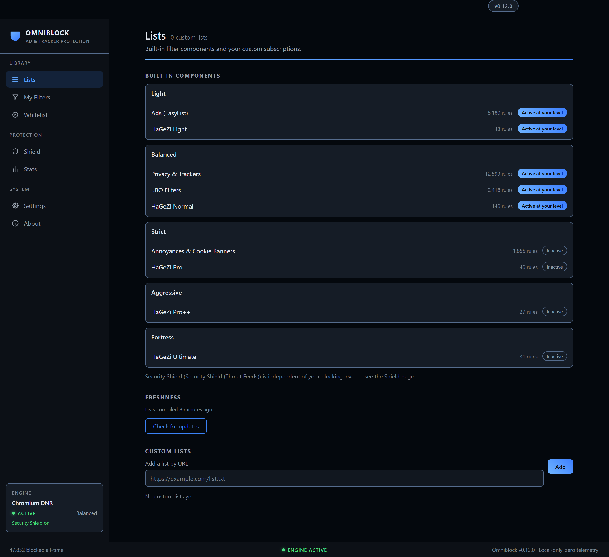 <b>Lists</b> — every built-in list, what it costs, and whether it is active at your level.</td>
<td width="50%">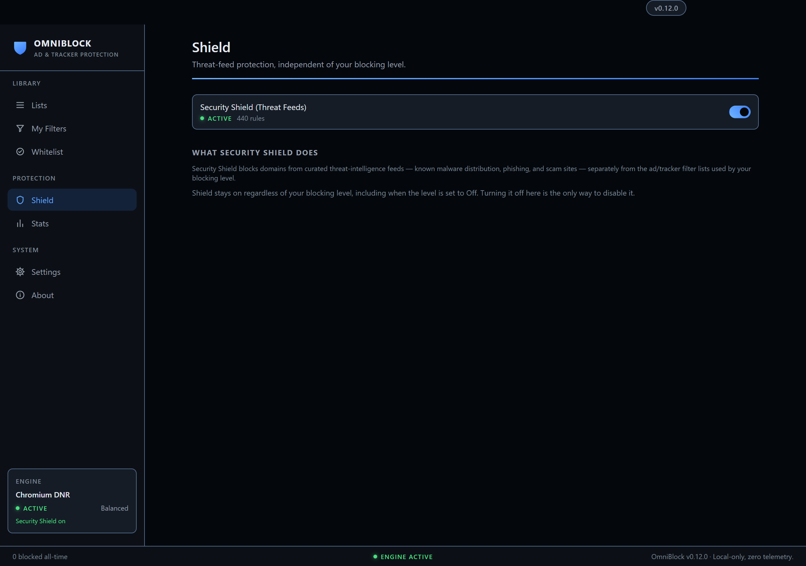 <b>Security Shield</b> — threat protection on its own switch, on even at level zero.</td>
</tr>
<tr>
<td>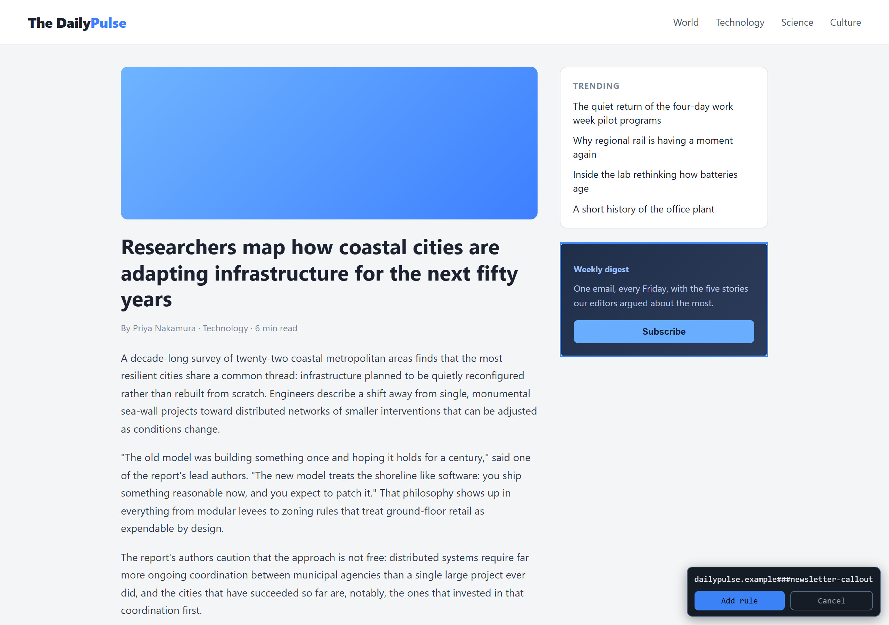 <b>Element picker</b> — click anything, and it stays gone.</td>
<td>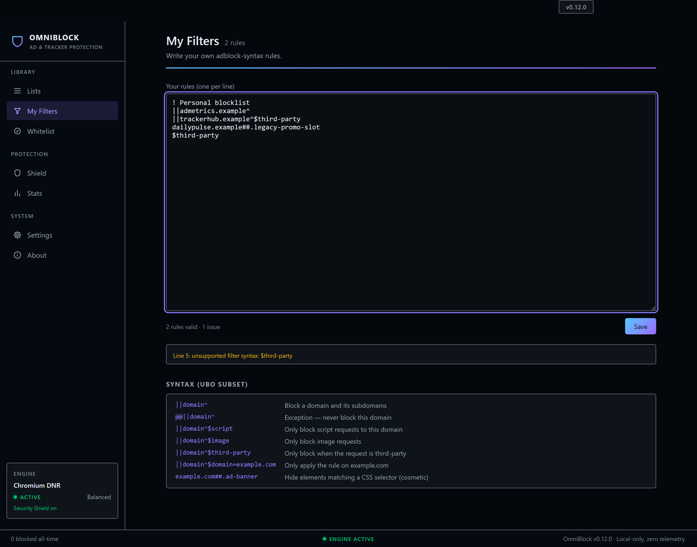 <b>My Filters</b> — uBlock-Origin-style syntax, validated as you type.</td>
</tr>
<tr>
<td>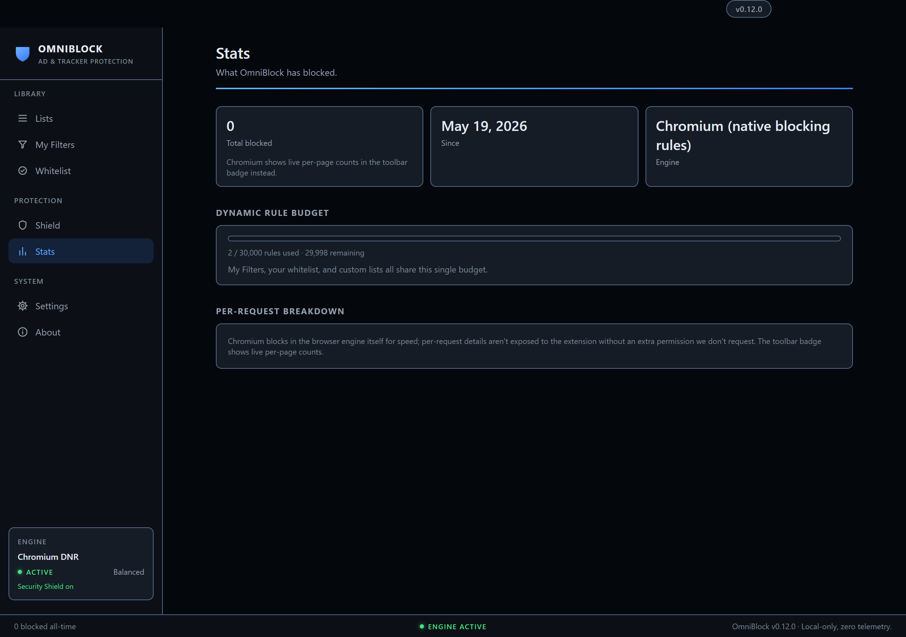 <b>Statistics</b> — local-only, and honest about what each engine can actually see.</td>
<td>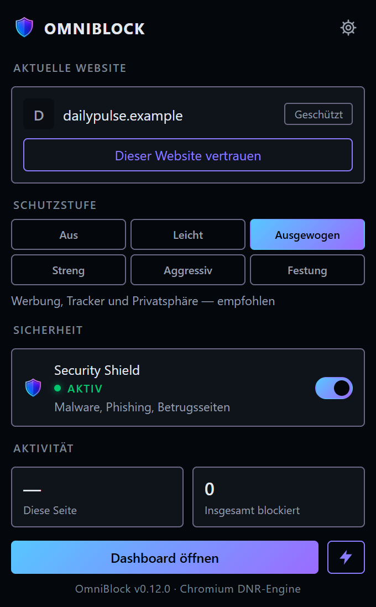 <b>Five languages</b> — the complete interface, not just the menus.</td>
</tr>
</table>

## Fast by construction

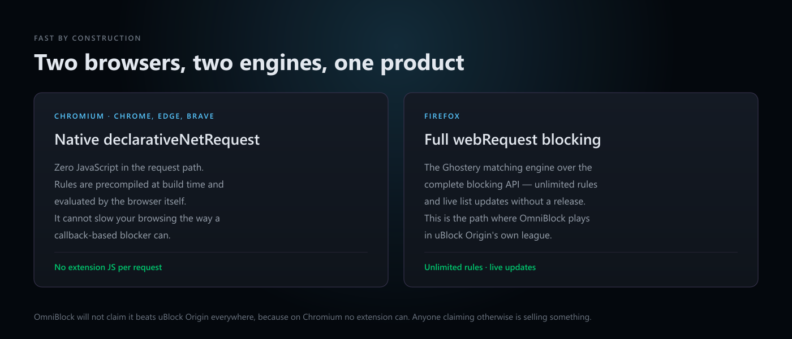

On Chromium, OmniBlock runs **no JavaScript in the request path at all**. Blocking
is handled by the browser's own native filtering engine from precompiled rulesets,
which is why it cannot slow your browsing the way a callback-based blocker can.

On Firefox, it uses full request blocking with the Ghostery matching engine —
unlimited rules and live list updates.

Both paths ship with measured numbers rather than promises. A benchmark harness
parses the real packaged filter text and reports engine memory, deserialize time,
cosmetic-pass cost and on-disk size; three of those — engine size, deserialize
time and packaged output size — are hard thresholds checked on a weekly run
against every real upstream source, and a breach fails that run loudly. The
ruleset compiler additionally fails the build outright if a level overruns
Chromium's static rule budget.

### Positioning, honestly

OmniBlock will not tell you it beats uBlock Origin everywhere, because that
would not be true.

On **Chromium**, Google removed the API that made uBlock Origin's dynamic
filtering possible. No extension can match MV2-era uBO there — not this one, not
any other. OmniBlock's real competitors on Chromium are uBO Lite and ABP, and it
aims to beat them on list depth, level ergonomics and per-site control, at
native speed.

On **Firefox**, full request blocking is still available, and OmniBlock plays in
uBO's own league.

Anyone claiming otherwise is selling something.

## Privacy by construction

**No telemetry. No analytics. No accounts. No servers.**

OmniBlock contacts exactly three kinds of address, and nothing else:

1. The filter-list hosts, to download public block lists.
2. Any custom list URL **you** add yourself.
3. Its own packaged files inside the extension.

Your browsing history never leaves your machine, because nothing ever sends it
anywhere. Statistics are computed and stored locally. There is no opt-out,
because there is nothing to opt out of.

Full detail: [Privacy Policy](docs/PRIVACY.md).

## Five languages

English, Deutsch, Español, Français and Română — the complete interface, not just
the menus. OmniBlock follows your browser's language automatically, and you can
override it at any time in the settings.

## Get OmniBlock

OmniBlock is **donationware**. It is not on the Chrome Web Store or on
addons.mozilla.org, and it is not sold. It is supported by the people who use it.

  
  &nbsp;&nbsp;
  

Supporters get the packaged, ready-to-install build for both browsers, the
complete source, and new releases as they land.

What you are paying for is the convenience and the ongoing work — **not**
exclusivity. OmniBlock is GPL-3.0-or-later: everyone who receives a build
receives the source with it, along with every freedom that licence grants.
[LICENSING.md](LICENSING.md) explains exactly what that means.

If you cannot afford to give anything, that is genuinely fine — say so and you
will get a copy anyway.

**Installation takes about a minute:** [docs/INSTALL.md](docs/INSTALL.md).

> **Note:** this repository is the showcase, not the delivery mechanism. It
> deliberately contains no source code and no builds — those go directly to
> supporters, with the complete source alongside every build, as the GPL
> requires.

## The OmniVex suite

OmniBlock is one of a family of tools sharing a design language and a philosophy
— modern, fast, privacy-respecting, no telemetry:

**OmniTheme** · **OmniBlock** · **OmniCleaner** · **OmniAPO** · **OmniEQ** · **OmniPlay** · **OmniScale** · **OmniShade** · **OmniVisuals** · **OmniGPU** · **OmniVex Gaming Wrappers**

**OmniVex Gaming Wrappers** is four Direct3D compatibility installers — OmniDXVK, OmniDxWrapper, OmniVKD3D and OmniVoodoo2.

Tuned for framerate, mixed for headroom, sharp to the pixel. Donationware
tools for gamers and audiophiles — audio, graphics, and a bit of privacy too.

## Support and bugs

Found something broken? [Open an issue](../../issues/new/choose) — bug reports
are welcome from everyone, supporter or not.

Security vulnerabilities: read [SECURITY.md](SECURITY.md) first; please do not
open a public issue for those.

## Licensing at a glance

- **The software** is GPL-3.0-or-later. You get the source, and you may study, modify and share it.
- **The name, logo and OmniVex identity** are not covered by that licence. Fork the code freely; give the fork its own name.

Full text: [LICENSING.md](LICENSING.md) · [TRADEMARK.md](TRADEMARK.md) · [Third-party notices](THIRD-PARTY-NOTICES.md)

---

Built by <b>OmniVex</b> · No telemetry, no tracking, no compromise

