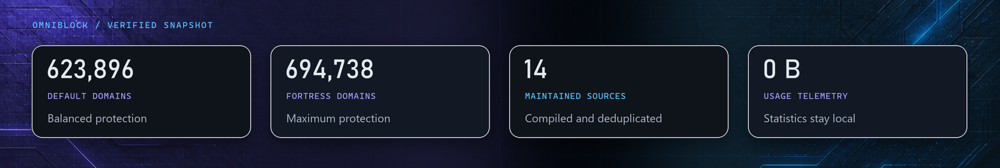
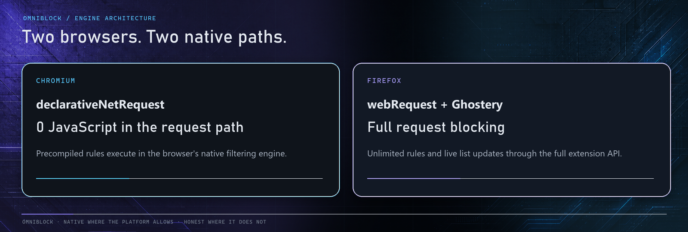

  

<h1 align="center">OmniBlock</h1>

<b>A content blocker for Chromium and Firefox — six protection levels, an always-on security shield, custom lists and per-site control.</b>

Part of the <a href="#the-omnivex-suite">OmniVex</a> suite.

  
  &nbsp;
  

<!-- Suite metadata: Version · Platform · Languages · Telemetry · Distribution -->

  
  
  
  
  

<!-- Quick navigation. These are clickable: each chip jumps to a section of this
     page, or to the document it names. Anchors are GitHub's own slugs for the
     headings below -- if a heading is renamed, its chip has to be renamed too. -->

  
  
  
  
  
  
  
  
  
  

> [!IMPORTANT]
> **Documentation-only repository.** This public repository contains OmniBlock documentation, approved artwork, and screenshots—not the extension source tree, packaged builds, store payloads, signing material, or private build infrastructure. Official distribution remains outside GitHub.

  

---

## What it does

OmniBlock blocks **623,896 distinct domains** at its default setting and
**694,738** at its highest level — ads, trackers, malware, phishing, scam and
fake-shop domains, compiled from fourteen maintained filter sources.

It is built around one idea: blocking should be something you *tune*, not
something you fight. One dial, six levels, and a security shield that stays on
even when you turn everything else off.

### Six protection levels

| Level | | What it blocks | Distinct domains |
|---|---|---|---:|
| 0 | **Off** | Blocking disabled — the shield stays on | 439,389 |
| 1 | **Light** | Ads only, maximum compatibility | 508,560 |
| 2 | **Balanced** | Ads, trackers and privacy — the default | 623,896 |
| 3 | **Strict** | Adds annoyances and cookie banners | 645,103 |
| 4 | **Aggressive** | Broader blocking, some sites may break | 669,328 |
| 5 | **Fortress** | Maximum blocking — expect breakage | 694,738 |

Counted from the compiled rulesets on 2026-08-19: unique domains across
every list active at that level, deduplicated — the same domain appearing in
three lists counts once. The upstream lists change daily, so read these as a
snapshot rather than a constant.

### The Security Shield

Malware, phishing, scam and fake-shop domains are handled on a **separate,
always-on axis** — including at level 0. Turning ads down should never turn
phishing protection off. That is a deliberate design decision, not a default
you have to remember to set.

### Everything else

- **Per-site trust** — one click in the popup, either permanently or only until the browser restarts.
- **Regional lists** — nine optional language-specific lists, disabled by default and free of rule-budget cost until enabled.
- **Element picker** — point at anything on a page, preview the generated cosmetic rule, then commit or revert it.
- **Element zapper** — remove page annoyances for the current visit without saving a rule.
- **Custom lists** — subscribe to any filter list by URL, in adblock or hosts syntax; Chromium converts safe `$redirect`, `$removeparam` and `$csp` rules to native DNR behavior.
- **My Filters** — write your own rules, validated line by line as you type.
- **Tracker neutralization** — packaged redirect stubs, tracking-parameter removal and CSP policies where each browser exposes a safe implementation path.
- **CNAME uncloaking on Firefox** — resolves disguised first-party tracker hosts through Firefox's own DNS API and blocks the real destination when it matches.
- **Statistics** — a running total, 30-day history and top blocked domains, computed and stored **only on your machine** on both browsers. Chromium's detailed feed is available because OmniBlock ships unpacked and feature-detects the native DNR debug event; unsupported store-packaged contexts show an explanation instead of invented data.
- **Import / export** — your whole configuration as a single JSON file.
- **Eleven languages** — see below.
- **A dark, deliberate interface** — part of the OmniVex design language, not a template.

## Fast by construction

On Chromium, OmniBlock runs **no JavaScript in the request path at all**. Blocking
is handled by the browser's own native filtering engine from precompiled rulesets,
which is why it cannot slow your browsing the way a callback-based blocker can.

On Firefox, it uses full request blocking with the Ghostery matching engine —
unlimited rules and live list updates.

Both paths ship with measured numbers rather than promises. A benchmark harness
parses the real packaged filter text and reports engine memory, deserialize time,
cosmetic-pass cost and on-disk size; three of those — engine size, deserialize
time and packaged output size — are hard thresholds checked on a weekly run
against every real upstream source, and a breach fails that run loudly. The
ruleset compiler additionally fails the build outright if a level overruns
Chromium's static rule budget.

### Positioning, honestly

OmniBlock will not tell you it beats uBlock Origin everywhere, because that
would not be true.

On **Chromium**, Google removed the API that made uBlock Origin's dynamic
filtering possible. No extension can match MV2-era uBO there — not this one, not
any other. OmniBlock's real competitors on Chromium are uBO Lite and ABP, and it
aims to beat them on list depth, level ergonomics and per-site control, at
native speed.

On **Firefox**, full request blocking is still available, and OmniBlock plays in
uBO's own league.

Anyone claiming otherwise is selling something.

## Eleven languages

English, Deutsch, Español, Français, Română, Русский, Türkçe, 简体中文, 繁體中文,
日本語 and 한국어 — the complete interface, not just the menus. OmniBlock follows
your browser's language automatically, and you can override it at any time without
restarting the browser. Plural forms follow each locale's CLDR rules.

## See it

<table>
<tr>
<td width="50%"> <b>Lists</b> — every built-in list, what it costs, and whether it is active at your level.</td>
<td width="50%"> <b>Security Shield</b> — threat protection on its own switch, on even at level zero.</td>
</tr>
<tr>
<td> <b>Element picker</b> — click anything, and it stays gone.</td>
<td> <b>My Filters</b> — uBlock-Origin-style syntax, validated as you type.</td>
</tr>
<tr>
<td> <b>Statistics</b> — local-only, and honest about what each engine can actually see.</td>
<td> <b>Eleven languages</b> — the complete interface, not just the menus.</td>
</tr>
</table>

## Privacy by construction

**No telemetry. No analytics. No accounts. No servers.**

OmniBlock contacts exactly three kinds of address, and nothing else:

1. The filter-list hosts, to download public block lists.
2. Any custom list URL **you** add yourself.
3. Its own packaged files inside the extension.

Your browsing history never leaves your machine, because nothing ever sends it
anywhere. Statistics are computed and stored locally. There is no opt-out,
because there is nothing to opt out of.

Full detail: [Privacy Policy](PRIVACY.md).

## Get OmniBlock

OmniBlock is **donationware**. It is not on the Chrome Web Store or on
addons.mozilla.org, and it is not sold. It is supported by the people who use it.

  
  &nbsp;&nbsp;
  

Supporters get the packaged, ready-to-install build for both browsers, the
complete source, and new releases as they land.

What you are paying for is the convenience and the ongoing work — **not**
exclusivity. OmniBlock is GPL-3.0-or-later: everyone who receives a build
receives the source with it, along with every freedom that licence grants.
[LICENSING.md](LICENSING.md) explains exactly what that means.

If you cannot afford to give anything, that is genuinely fine — say so and you
will get a copy anyway.

**Installation takes about a minute:** [INSTALLATION.md](INSTALLATION.md).

> **Note:** this repository is the showcase, not the delivery mechanism. It
> deliberately contains no source code and no builds — those go directly to
> supporters, with the complete source alongside every build, as the GPL
> requires.

## Documentation

| | |
|---|---|
| [Installation](INSTALLATION.md) | Install the packaged extension in Chrome or Firefox |
| [Privacy](PRIVACY.md) | Local data, network requests and telemetry boundaries |
| [FAQ](FAQ.md) | Common installation, filtering and browser questions |
| [Support](SUPPORT.md) | Useful reports, privacy redaction and contact routes |
| [Security](SECURITY.md) | Private vulnerability reporting |
| [Contributing](CONTRIBUTING.md) | Documentation and reproducible-report scope |
| [Changelog](CHANGELOG.md) | Release history |
| [Licensing](LICENSING.md) | GPL terms, distribution and source availability |
| [Third-party notices](THIRD-PARTY-NOTICES.md) | Upstream engines, lists and licences |

## The OmniVex suite

OmniBlock is one of a family of tools sharing a design language and a philosophy
— modern, fast, privacy-respecting, no telemetry:

**OmniTheme** · **OmniBlock** · **OmniCleaner** · **OmniAPO** · **OmniEQ** · **OmniPlay** · **OmniScale** · **OmniShade** · **OmniVisuals** · **OmniGPU** · **OmniWrappers**

**OmniWrappers** is four Direct3D compatibility installers — OmniDXVK, OmniDxWrapper, OmniVKD3D and OmniVoodoo2.

Tuned for framerate, mixed for headroom, sharp to the pixel. Donationware
tools for gamers and audiophiles — audio, graphics, and a bit of privacy too.

More at [github.com/TheOmniGrid](https://github.com/TheOmniGrid).

---

## Credit

OmniBlock stands on the filter lists and blocking engine maintained by others.

It bundles **[uBlock Origin's uAssets](https://github.com/uBlockOrigin/uAssets)** filter
rules and scriptlet/redirect resources (GPL-3.0), **EasyList** and **EasyPrivacy**
(GPL-3.0-or-later, dual CC BY-SA 3.0+), **Fanboy's Cookie Monster / EasyList Cookie List**
(CC BY 3.0), and **[HaGeZi's DNS Blocklists](https://github.com/hagezi/dns-blocklists)**
(GPL-3.0). Bundling GPL-3.0 rules and data into the package this way is what makes the
combined work GPL-3.0 as a whole.

Matching is done by **[Ghostery's adblocker engine](https://github.com/ghostery/adblocker)**
(MPL-2.0), alongside `tldts` (MIT), `webextension-polyfill` (MPL-2.0) and Svelte (MIT).

Full attribution in [THIRD-PARTY-NOTICES.md](THIRD-PARTY-NOTICES.md).

**Licensing at a glance:** the software is GPL-3.0-or-later — you get the source, and you
may study, modify and share it. The name, logo and OmniVex identity are not covered by that
licence; fork the code freely, but give the fork its own name.
[LICENSING.md](LICENSING.md) · [TRADEMARK.md](TRADEMARK.md)

---

## Contact

Use public channels only for information that is safe to share. Remove usernames, local paths,
account identifiers, licence data, and other personal information from screenshots and logs.

| Channel | Use |
|---|---|
| [GitHub Issues](../../issues/new/choose) | Reproducible bugs, compatibility reports, and documentation corrections |
| [GitHub Discussions](../../discussions) | Questions, ideas, and community support |
| [Security](SECURITY.md) | Private vulnerability reporting — never use a public issue |
| [Email](mailto:omnivex@theomnigrid.biz) | Private support, delivery, or licensing questions |

Support is best-effort. See [SUPPORT.md](SUPPORT.md) and [CONTRIBUTING.md](CONTRIBUTING.md)
for repository scope and reporting guidance.

---

  <strong>OmniBlock</strong> 
  <a href="https://github.com/TheOmniGrid">The OmniGrid on GitHub</a> ·
  <a href="https://ko-fi.com/theomnigrid">Ko-fi</a> ·
  <a href="https://www.patreon.com/TheOmniGrid">Patreon</a>  
  Copyright © 2026 OmniVex · GPL-3.0-or-later · <a href="LICENSING.md">Legal &amp; licensing</a> 
  The OmniVex name and logo are not covered by the GPL licence.

